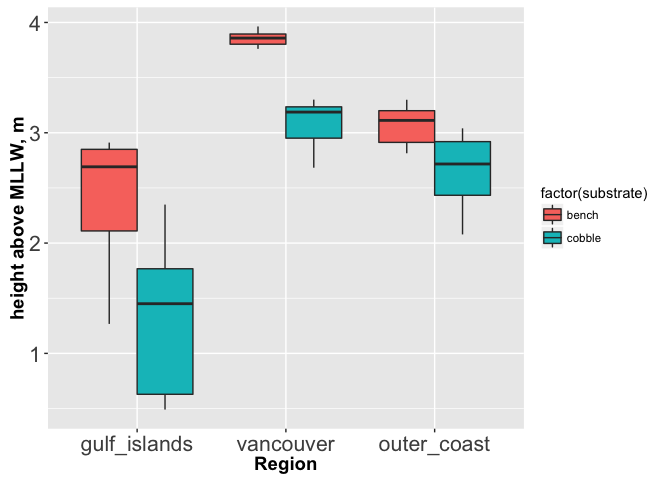
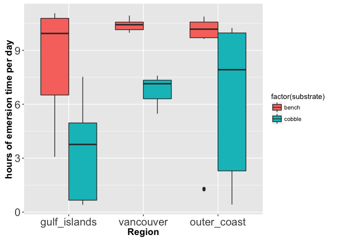

# Barnacle upper limit surveys


Load packages

```r
library(dplyr)
library(ggplot2)
library(broom)
```


Read in data

```r
emersion <- read.csv("~/Documents/barnacle/emersion_time_upperlimits.csv")
emersion_noBoulder <- emersion %>% 
	filter(substrate != "boulder")

emersion_noBoulder <- emersion_noBoulder %>% 
	mutate(emersion_time_hours = ((total/60)/29))
```


Plot the upper limit in terms of height above MLLW

```r
emersion_noBoulder$Region <- ordered(emersion_noBoulder$Region, levels = c("gulf_islands", "vancouver", "outer_coast"))


emersion_noBoulder %>% 
ggplot(data = ., aes(x = Region, y = mean_height, fill = factor(substrate))) + geom_boxplot() + 
	ylab("height above MLLW, m") +
	theme(axis.text=element_text(size=16),
				axis.title=element_text(size=14,face="bold"))
```

<!-- -->

Plot upper limit in terms of emersion time

```r
emersion_noBoulder %>% 
ggplot(data = ., aes(x = Region, y = emersion_time_hours, fill = factor(substrate))) + geom_boxplot() + 
	ylab("hours of emersion time per day") +
	theme(axis.text=element_text(size=16),
				axis.title=element_text(size=14,face="bold"))
```

<!-- -->

Model fit of emersion hours as a function of substrate and region

```r
summary(lm(emersion_time_hours ~ substrate + Region, data = emersion_noBoulder))
```

```
## 
## Call:
## lm(formula = emersion_time_hours ~ substrate + Region, data = emersion_noBoulder)
## 
## Residuals:
##    Min     1Q Median     3Q    Max 
## -8.059 -0.484  0.501  1.546  4.514 
## 
## Coefficients:
##                 Estimate Std. Error t value Pr(>|t|)    
## (Intercept)       9.1711     0.5538  16.560  < 2e-16 ***
## substratecobble  -3.5668     0.8124  -4.391 5.86e-05 ***
## Region.L          1.0290     0.6859   1.500    0.140    
## Region.Q         -1.4618     0.7246  -2.018    0.049 *  
## ---
## Signif. codes:  0 '***' 0.001 '**' 0.01 '*' 0.05 '.' 0.1 ' ' 1
## 
## Residual standard error: 2.969 on 50 degrees of freedom
## Multiple R-squared:  0.323,	Adjusted R-squared:  0.2824 
## F-statistic: 7.951 on 3 and 50 DF,  p-value: 0.0001968
```

Parameter estimates and confidence intervals for emersion_time_hours ~ substrate + Region

```r
emersion.fit <- tidy(lm(emersion_time_hours ~ substrate + Region, data = emersion_noBoulder), conf.int = TRUE)
knitr::kable(emersion.fit, align = 'c', format = 'markdown', digits = 2)
```


|      term       | estimate | std.error | statistic | p.value | conf.low | conf.high |
|:---------------:|:--------:|:---------:|:---------:|:-------:|:--------:|:---------:|
|   (Intercept)   |   9.17   |   0.55    |   16.56   |  0.00   |   8.06   |   10.28   |
| substratecobble |  -3.57   |   0.81    |   -4.39   |  0.00   |  -5.20   |   -1.94   |
|    Region.L     |   1.03   |   0.69    |   1.50    |  0.14   |  -0.35   |   2.41    |
|    Region.Q     |  -1.46   |   0.72    |   -2.02   |  0.05   |  -2.92   |   -0.01   |

Model fit of height above MLLW as a function of substrate and region

```r
summary(lm(mean_height ~ substrate + Region, data = emersion_noBoulder))
```

```
## 
## Call:
## lm(formula = mean_height ~ substrate + Region, data = emersion_noBoulder)
## 
## Residuals:
##      Min       1Q   Median       3Q      Max 
## -1.03309 -0.21671  0.02264  0.22455  0.82518 
## 
## Coefficients:
##                 Estimate Std. Error t value Pr(>|t|)    
## (Intercept)      3.11164    0.07929  39.245  < 2e-16 ***
## substratecobble -0.74576    0.11630  -6.412 4.99e-08 ***
## Region.L         0.67886    0.09820   6.913 8.20e-09 ***
## Region.Q        -0.88683    0.10373  -8.549 2.38e-11 ***
## ---
## Signif. codes:  0 '***' 0.001 '**' 0.01 '*' 0.05 '.' 0.1 ' ' 1
## 
## Residual standard error: 0.425 on 50 degrees of freedom
## Multiple R-squared:  0.7452,	Adjusted R-squared:  0.7299 
## F-statistic: 48.75 on 3 and 50 DF,  p-value: 7.099e-15
```

Parameter estimates and confidence intervals for height above MLLW as a function of substrate and region

```r
emersion.fit <- tidy(lm(mean_height ~ substrate + Region, data = emersion_noBoulder), conf.int = TRUE)
knitr::kable(emersion.fit, align = 'c', format = 'markdown', digits = 2)
```


|      term       | estimate | std.error | statistic | p.value | conf.low | conf.high |
|:---------------:|:--------:|:---------:|:---------:|:-------:|:--------:|:---------:|
|   (Intercept)   |   3.11   |   0.08    |   39.25   |    0    |   2.95   |   3.27    |
| substratecobble |  -0.75   |   0.12    |   -6.41   |    0    |  -0.98   |   -0.51   |
|    Region.L     |   0.68   |   0.10    |   6.91    |    0    |   0.48   |   0.88    |
|    Region.Q     |  -0.89   |   0.10    |   -8.55   |    0    |  -1.10   |   -0.68   |

